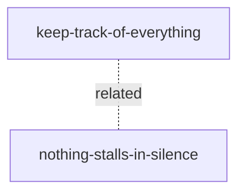

# Product features

Standing doc: [principles.md](principles.md). Template: [_templates/product-feature.md](../_templates/product-feature.md).

| Feature | Story | Audience | Importance | Status | Requires |
| --- | --- | --- | --- | --- | --- |
| [keep-track-of-everything](keep-track-of-everything.md) | As a developer with many agents and conversations going at once, I can keep track of everything that is going on and get to any of it in seconds, so that nothing is lost and nothing depends on my memory. | user | 1.0 | proposed | — |
| [nothing-stalls-in-silence](nothing-stalls-in-silence.md) | As a developer who lets agents run unattended, I can trust that work needing my decision will tell me and keep telling me until I answer, so that walking away is safe. | user | 0.7 | proposed | — |

## Dependency graph

