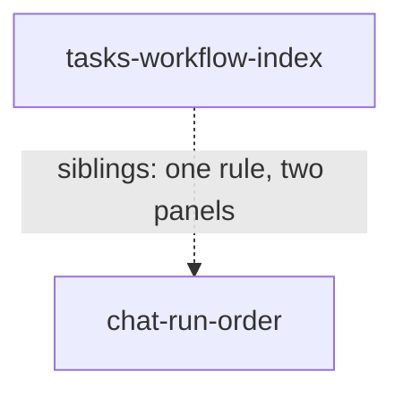

# Product features

Standing doc for this area: [principles.md](principles.md) — who we serve, what
we optimize for, what we refuse to do. Read it before framing a feature.

One row per feature. Source: [WORKFLOW.md §1](../../WORKFLOW.md). Template:
[_templates/product-feature.md](../_templates/product-feature.md).

| Feature | Story (short) | Audience | Importance | Status | Requires |
| --- | --- | --- | --- | --- | --- |
| [tasks-workflow-index](tasks-workflow-index.md) | Find the workflows a project has work in, from the drawer, and jump to one from any depth | developer | 0.55 | proposed | — |
| [chat-run-order](chat-run-order.md) | Conversations still owed you an answer above the rest, then by when they ended | developer | 0.45 | proposed | — |

**What the number means here.** Importance is value if shipped, nothing else —
not confidence, not cost, not risk. A 1.0 in this catalog would be a feature the
product does not work without; both of these are navigation improvements to
surfaces that already function, so both sit in the middle of the scale and the
top band is empty because nothing has earned it, not because the scale is broken.
`tasks-workflow-index` fills a drawer that is empty, against a list that already
exists and is merely sorted wrong — **and that is what makes it level with its
sibling, not what makes it higher.** What makes it higher is the second half, the
jump to another workflow from depth. The previous version of this line stopped at
the empty drawer and then contradicted itself two paragraphs down; the repair is
worked through below.

**That warrant is a code reading, not a quotation, and the previous version of
this line got the attribution wrong.** It said the emptiness was "the gap the
issue actually names". The issue names no such gap: it says "Files currently shows
useful contents, but both chat and tasks can be improved", which treats the two
symmetrically and asserts nothing about either being absent. The asymmetry is real
but it was **found in the code** — the Tasks sidebar row is built with `counts`
and `onSeen` and carries no `panel` key at all, where the Chat row
(`App.tsx:1419`) and the Files row (`App.tsx:1435`) each carry one
(`App.tsx:1402-1412`). The conclusion is unchanged and the evidence is stronger
than the misquotation was; it is corrected because a reader checking the brief for
the sentence being relied on would not have found it.

**That justification and the number were pointed at different things, and this
file previously let them pass for one.** The value above is *parity*: the Tasks
drawer is the only one of the three panels that enumerates nothing, and a panel
that enumerates nothing is a broken contract no matter how many workflows anyone
runs. The census gate this file used to carry read something else entirely — how
many workflows a person has live at once. A census cannot cut parity, so the two
had to be scoped apart. Scoped:

- **Filling the drawer at all** — one row per (project, workflow) pair the project
  holds a task under, at **any** status rather than only a running one, which is the
  definition that doc settles and which an earlier version of this line contradicted
  by saying "showing what is running". Value here is parity and it is **not** gated
  on any count. A one-row index is still a drawer that answers "what is going on
  here" instead of a drawer that answers nothing. This is the half the story is
  written about, it **sets the floor**, and it is also the half whose second warrant
  decays as a project's authored workflows all get used — worked through below.
- **Choosing between rows, and jumping from depth** — the walk-back-up claim. This
  half needs the person to have more than one row to choose between, and it is the
  **delta above that floor**.

**The floor is 0.45 and the delta is 0.10 — and the previous version of this file
had that relation backwards.** It said parity "is what holds the number above its
sibling", and then said a failed census drops the number to 0.45, level with the
sibling. Both cannot hold: a failed census leaves parity untouched, so if parity
were what put this feature above its sibling the fallback would have to be above
0.45 too. Two paragraphs later the same file reasoned from the right premise —
"the argument for the fallback is parity and parity does not rank below a re-sort
of a list that already enumerates" — and stopped one step short of noticing what
it had shown. That argument establishes parity **≥** 0.45, which makes parity the
floor, level with the sibling rather than above it. What lifts this feature to 0.55
is the jumping half, and nothing else does.

**And the census gate is deleted — on a narrower argument than the last pass
gave.** That the read cut nothing was established and stands: a drawer at every
depth is free (the sidebar row never reads `levels`) and drilling on click is the
brief's own instruction, so all it could move was the number, between 0.55 and
0.45. What the last pass then wrote was that **no outcome of the read changes what
anyone builds next**, and that is false. It leaned on the risk paragraph below
saying the sibling "carries neither; it is smaller and it ships" — a sentence that
was itself wrong, corrected there — and it ignored that under *value* sequencing
the read plainly does change the order: pass and this feature goes first, fail and
the tie breaks toward the cheaper sibling.

**The correct argument is about what that order costs, not about whether the read
moves it.** These two features neither require nor block each other — `requires: []`
on both sides, and the graph below draws a sibling relation rather than a
dependency — so the only consequence of ordering them wrongly is that one waits
behind the other, and the choice can be reversed on any morning by picking up the
other one. Whichever goes second is built exactly as it would have been. **A
working week of hourly journal sampling, plus two threshold arguments to settle
before the sampling starts, is the wrong price for a reversible ordering choice**,
and that is the whole of why the gate went. (There is also a world where the
sibling's own pre-build read comes back shallow and it is not built at all — in
which case there is no order and the census would have sequenced this feature
against nothing.)

So the number is set by **argument** and offered at the gate as a judgement to
overrule rather than a threshold to verify: 0.45 of parity, plus 0.10 for the jump
from depth — which is argued from structure, since once you are drilled into a
workflow no workflow is on screen and the only route to a sibling is back up the
address. **And the two halves are not equally solid, which the sibling doc now
works through.** The floor stacks two warrants — the contract one (a drawer that
enumerates nothing beside two that do) and a filtering one (the panel lists where
work is, the column strip lists everything authored) — and the second decays: the
panel's rows are a subset of the columns, the gap is the authored-and-unrun flows,
and on a fully exercised project that gap is empty. The delta does not decay at any
project age. So it is the **floor** that is soft, and a gate ranking this for a
mature project is buying the jump plus a contract repair rather than a census.
What the census would have answered is *how many* people are positioned to use the
jump — a real question, worth taking on the day someone ranks this against a third
feature, and not worth a week to order two siblings that are each waiting on their
own conditions anyway.

Three things the deleted read got right are kept in
[tasks-workflow-index](tasks-workflow-index.md) § Metrics so that nobody re-derives
them: it had to come from the journal rather than from `task_runtime`, whose start
and end columns are overwritten on every resume; "live at once" was a lower bound
on the rows the panel offers rather than an estimate of them, since a row exists
for any retained task; and the depth condition was a proxy — where a *run* sits in
its state tree, standing in for where a person was looking.

An older version of the fallback said "roughly 0.4 — level with `chat-run-order`",
which is not level with 0.45; it was the prose and not the sibling's number that
was wrong.

**Risk is tracked separately, and it runs the other way.** The previous version
of this file folded risk into the number and then told the reader to invert it,
which left the scale ordering nothing. Stated plainly instead:

- `tasks-workflow-index` carries one condition that can end it outright at build
  time — a finding that the panel and the root board columns are **the same
  gesture**, which its doc says should be resolved by cutting rather than shipping
  the duplicate route. **That condition is narrower this pass than it read before.**
  It is about where the panel is *reachable from*, not about what it lists: the
  panel's rows are a subset of the columns and the two sets coincide on any project
  whose authored workflows have all been run within retention, which is a fact
  about the project rather than about the build. A build cannot be cut on a
  condition that would make it a duplicate for one person and not for another; it
  can be cut on offering the list only where the column strip already is. The
  census read that used to sit beside this was never risk — it bore on how the
  feature ranks, not on whether the build succeeds — and it is deleted outright,
  above.
- `chat-run-order` **carries two live conditions, and the previous version of this
  line said it carried none.** Its first metric is a pre-build read with an explicit
  don't-build outcome ("deeper than a drawer of visible rows on either, or there is
  nothing here to fix"), and its value metric needs a `ui.seen` before-sample that
  has to be taken prior to shipping and that nobody has been assigned. Neither is a
  late build-time failure in the sibling's sense — the code is one field, one spread
  and one `useMemo`, and none of it can collapse at the end — but both can stop the
  feature before it starts, which "it is smaller and it ships" flatly denied. **This
  matters beyond the sentence**: the deletion of the census gate was argued from it,
  and that argument is re-made above on a different and weaker ground.

If you are sequencing on risk rather than on value, the sibling is still the one
to build first — its conditions are cheap reads taken before any code is written,
where this feature's is a judgement that can only be made once there is something
on screen. That is a sequencing decision, it does not change either number, and it
is reversible, which is the reason nothing was worth measuring to settle it.

**Both docs were re-checked against the runs collapse this pass, and it moved
things.** Migration 16 folded the `runs` table into the task (`migrations.ts:415`),
which invalidated two arguments the previous versions leaned on: `chat-run-order`
defended its central substitution against a table that no longer exists, and
`tasks-workflow-index` gated itself on a read — `runs.started_at` /
`runs.ended_at` — that can no longer be taken. Both are repaired in place. Neither
importance moves: `chat-run-order` got **cheaper** (the sort key is now a column
`taskSummaries` already holds, so the build is a field and a spread rather than a
per-task lookup) and its argument got **weaker but sounder**, since the literal
per-run reading now has no rows rather than the wrong rows; `tasks-workflow-index`
moved its gate read to the journal, and has since deleted the gate altogether for
the reason given above, which makes the repair moot rather than wrong.

**The higher-importance one ships wholly uninstrumented, and this file has now
said that twice with a wrong retraction in between.** `tasks-workflow-index`
claims a trip not taken — the walk back up the address — and nothing in any store
records where a person was standing (`levels` is in-memory, last-value renderer
state). An early version said the whole feature ships unmeasurable. The version
before this one **retracted** that, on the grounds that the per-row status roll-up
had a post-ship measure once it moved into the necessary set. **The retraction was
wrong and is itself withdrawn.** The measure it named was `ui.seen`, and the Tasks
sidebar row's clear gesture marks *every* task in the project in one call —
`markSeenAll(runsOf(atSummary))` (`App.tsx:1411`), wired to the Pills' `onClear`
(`sidebar.tsx:327`) — stamping each task at its own clock (`store.ts:3227`), so a
bulk clear is indistinguishable in the stored map from having read every row. A
falling median is as consistent with "the drawer gave me a reason to visit the row
and I cleared the pills" as with anything about a workflow's contents, and the
confound cannot be filtered out afterwards. So the early version was right: **no
part of that feature can be checked after it ships.** The alternative is a
navigation-event log, which is unscoped and which nobody has decided to build.

`chat-run-order` is exposed to the same bulk clear (`App.tsx:1417`) and its value
measure survives anyway, because its panel already ships: the before/after compares
one surface against itself with the same clear gesture on both sides and only the
order changing. The measurable feature is the smaller and lower-ranked one, which
is worth noticing before the gate rather than after.

## Dependency graph

How the features hold each other up. Update whenever a `requires` changes.

Neither requires the other; they are drawn together because they share a
contract — **a side panel enumerates the one kind of thing its activity is about,
and the middle shows one of them.** Files already obeys it. Cutting either leaves
the other standing.

The edge is drawn dashed and undirected because it is a sibling relation, not a
dependency, and **both docs now declare it**: each carries the other in
`siblings`, and both carry `requires: []`. Previously only `tasks-workflow-index`
did, so this graph drew an edge one end of which was not written down anywhere.

## Cut or reduced

Features that were specified and then shipped smaller, or not at all, and what
decided it. Kept so the same thing is not re-proposed blind.

**This table records departures in one direction only, and that turned out to
matter.** Everything below is a narrowing of the brief. Nothing here could record
a *widening* of it, so the two places these features add a necessary thing the
person did not ask for were invisible to the gate by construction — not hidden,
but with nowhere to be written. They are in § Added beyond the brief, immediately
after this table, and the two are read together.

| Feature | Outcome | Decided by |
| --- | --- | --- |
| chat-run-order — "a list of **runs**", as the issue words it | **No longer a reduction, and the row is kept only to record that.** The literal reading names rows the product no longer has; one row per conversation is the only reading with rows behind it | Migration 16 retired the `runs` table (`migrations.ts:415-416`), and `RunView` is now one per task — "a resume CONTINUES the machine under the same task, and a re-run is a new task linked by `parentTaskId`, so there is no second attempt to list" (`view.ts:228-231`). So a re-run is already a conversation row, a resume adds no row anywhere, and a typed turn was never a run (`service.ts:3251`). **The previous version of this row argued the reduction against the `runs` table and a missing cross-task IPC channel, and both of those are now gone** — as is the "offered back at the gate" it ended with, since the gate cannot restore rows by deciding to. What a person can still decide is whether per-attempt history is wanted as a **separate** feature, rebuilt from `state_machine_events`: see [chat-run-order](chat-run-order.md) § What the brief asked for and § Open questions |
| chat-run-order — "**uncompleted first**", as the issue words it | Narrowed: `canceled` conversations sort **below** the line with completed ones, not above it with the rest of the uncompleted | This is a **departure from the brief**, not from a codebase predicate, and the earlier version of this row's argument did not exist because the feature doc argued only against `isTerminalStatus` and `isStartableStatus` and never named the instruction it was overruling. Read literally, "uncompleted first" puts a conversation you personally stopped above one that answered you. The reason for overruling it is that you already know about a thread you ended yourself and can find it by name, whereas the line exists to surface threads that still owe you something. It is the row in this catalog most likely to be wrong, because it is the only place either feature contradicts a direct instruction. **Offered back at the gate**: see [chat-run-order](chat-run-order.md) § What the brief asked for |
| tasks-workflow-index — subsidiary tasks shown individually under their parent's row | Deferred to nice-to-have; they are **counted** in the parent workflow's row but not drawn separately | Reduced, not dropped: the row groups by the board's own `homeOf` walk (`stateViews.ts:638`), so a spawned task files under its topmost ancestor's workflow. Only the individual display is deferred. A previous version said subsidiary tasks were suppressed entirely, which would have made a row's count disagree with the board column it opens |
| tasks-workflow-index — "a list item per **top level workflow**", as the issue words it | One row per *workflow*, counting its tasks — three concurrent runs of one workflow are one row, not three | The board already groups this way (`stateViews.ts:608`), and a row per run puts the middle column's cards in the drawer. The consequence is named rather than hidden: someone running one workflow repeatedly gets a one-row index and is **not served** by this feature. The phrase "top level" carries a second reading too — the top of the *task* tree, not the state tree — and it lands on the roll-up in the row above; both are now labelled against the brief's wording rather than left inside Scope. **Offered back at the gate**: see [tasks-workflow-index](tasks-workflow-index.md) § What the brief asked for |
| tasks-workflow-index — a flat census of workflows across every project | Reduced to a per-project census: a row is a **(project, workflow) pair**, and at the root address the list is sectioned by project | The destination is per-project — `drillProject(project, level)` writes `levels[project]` (`store.ts:2526-2530`) — so a projectless row has nowhere to go, and one workflow id legitimately runs under several projects ("a shared root is a column on every board", `App.tsx:1843`). The roll-up rule is per-project too: `homeOf` walks `parentTaskId` inside one project's records and stops at a parent it holds no row for (`stateViews.ts:634`). A previous version claimed the panel "answers it flat, across projects", which the click could not have delivered. Note this **widens** the panel — one workflow run in two projects is two rows; see [tasks-workflow-index](tasks-workflow-index.md) § What the brief asked for |
| tasks-workflow-index — "click to show **the task view contents** of that workflow" | Click drills the board to that workflow | The alternatives are `selectWorkflow`, which already has a route from the column strip (`App.tsx:1845`), and `openTask`, which needs a rule for which of N tasks to open. **Offered back at the gate**: same section |

> The exploration proposed a third row here — "Chat ordered by true completion
> date → ordered by task `updatedAt`, decided by `runs` having no index on
> `ended_at`." It is **not** recorded, and the premise is now false twice over:
> `endedAt` was already computed (`projection.ts:409`, called at
> `stateViews.ts:680`) with an exported renderer helper (`board.tsx:60`), and
> since the runs collapse it is a plain column on the task's own runtime row
> (`runtime.ts:41-42`) that `taskSummaries` already has in hand. There is no
> index to add and no lookup to pay for. See [chat-run-order](chat-run-order.md)
> § Cost. Kept visible so the same concession is not re-proposed on the same wrong
> grounds.

## Added beyond the brief

Things in the **necessary** set of a feature that the issue did not ask for. A
narrowing is offered back at the gate because the table above exists; a widening
had no row until this pass, so both of these reached a gate as settled scope when
they are proposals. Each is argued in its own doc and each is now a gate question
there rather than only a design one.

| Feature | Added | Why it was proposed, and what cutting it leaves |
| --- | --- | --- |
| chat-run-order — **a visible boundary between the two groups** | A structural rule line or group heading drawn between unsettled and settled rows, in the necessary set ([chat-run-order](chat-run-order.md) § Scope) | The brief asks for an order and nothing drawn: "a list of runs ordered by completion date descending (uncompleted first, oldest last)". The argument for it is that the story ends "*without opening them one at a time*", and an order alone does not say where the seam is — rows sorted unsettled-first look like rows sorted by recency until you know where the line falls, and the marks already on a row do not cover it (`interrupted`, `queued` and `failed` carry no mark at all, `chatPane.tsx:286`, `:295`). The counter is that the person asked for a sort. **Cutting it leaves exactly what the issue requested**, which is why it has to be a gate question and not a design one. **Offered back at the gate** |
| tasks-workflow-index — **a count and a status roll-up on each row** | Numbers on the row, counted in the board's lanes, in the necessary set ([tasks-workflow-index](tasks-workflow-index.md) § Scope) | The brief asks for "a list item per top level workflow that you can click on" — an item and a click. The argument is that the story's first half is *seeing where work stands* and a row reading `feature` is a row you still have to open; the counter is that the board one click away already draws those tasks split into the same lanes. It costs nothing to build (both numbers come off the array the rows are grouped from), which is precisely how it got into the necessary set without anyone deciding to add it. **Offered back at the gate** |

Two additions, both in the same shape: cheap, well argued, and never put to the
person whose sentence they extend. Neither is withdrawn here — the arguments are
good — but each doc now asks whether it should exist rather than only what it
should look like.

## Exceptions to principles

Features that deliberately depart from [principles.md](principles.md). Three
against the same rule means the rule is wrong.

| Feature | Rule | Why |
| --- | --- | --- |
| _none_ | | |

Both current features were checked against the two clauses that are filled in and
conform: neither writes anything on the user's behalf (both are read-only
listings), and neither moves a run past a gate. Recorded as a check rather than
as silence, since phase 8 cannot tell the two apart.

Both features also reject the same alternative — rank the list by what is waiting
on a human — and two previous revisions tried to promote that rejection into a
standing amendment under "What we refuse to do", which is still unwritten.

**This revision withdraws the amendment.** No `standing_amendment` is submitted
with this phase, and `principles.md` is unchanged: still `updated: 2026-08-04`,
still one Amendments row, still "_To write._" under the heading it would have
filled. That is a decision, not an omission, and the reasoning is recorded here so
the next pass does not attempt it a fourth time blind.

Two general forms were written, and each failed a check a reader can repeat:

1. *"A listing surface may not rank by a judgement about what the person ought to
   do next."* "Judgement" does not discriminate. Every ordering rule in both
   features is a judgement about what matters, including the one deciding that an
   unanswered thread outranks an answered one. The amendment forbade its own
   features.
2. *"Sort on stored state, never on live state."* This picked the wrong winner. The
   rejected alternative's key is derived from `call.waiting` / `call.settled`
   rows in the append-only journal (`projection.ts:180-195`), indexed and
   replayable; the two features sort on `task_runtime.status`, a last-value column
   overwritten in place with no history (`db.ts:23-32`). Judged by where the key
   is stored, the alternative scores **better** than the features the rule existed
   to permit.

Two attempts, failing in opposite directions — one too broad, one inverted — are
evidence the general rule is not there to be found at this level of abstraction,
or at least not by this state. Rather than write a third under the same pressure,
the concrete reasoning stays where it already is and no principle is claimed.
**Nothing is lost by this**, which is the reason withdrawal is cheap: neither
feature ever leaned on the amendment, and each Framings row carries its own
checkable grounds — the missing cross-task index, the missing IPC channel, a sort
key that clears when you answer it, two routes to one view.

What a future pass would need in order to try again: a statement of the
distinction that (a) permits both of these features, (b) refuses the resume queue,
and (c) is decidable by reading the code rather than by weighing intent. The
closest this pass got is that the alternative's key *erases itself when used* —
answering the top row is what demotes it — which is a real property but describes
one interaction pattern rather than a rule about listing surfaces. It is offered
as a starting point, not as a submission.
