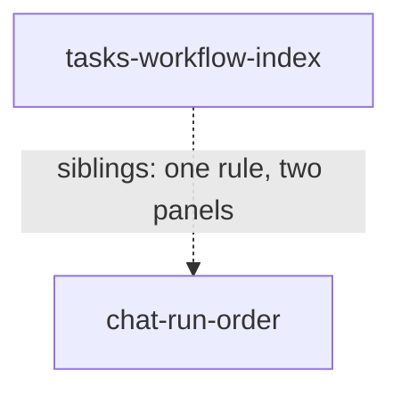

# Product features

Standing doc for this area: [principles.md](principles.md) — who we serve, what
we optimize for, what we refuse to do. Read it before framing a feature.

One row per feature. Source: [WORKFLOW.md §1](../../WORKFLOW.md). Template:
[_templates/product-feature.md](../_templates/product-feature.md).

| Feature | Story (short) | Audience | Importance | Status | Requires |
| --- | --- | --- | --- | --- | --- |
| [tasks-workflow-index](tasks-workflow-index.md) | Find the workflows a project has work in, from the drawer, and jump to one from any depth | developer | 0.55 | proposed | — |
| [chat-run-order](chat-run-order.md) | Conversations still owed you an answer above the rest, then by when they ended | developer | 0.45 | proposed | — |

**What the number means here.** Importance is value if shipped, nothing else —
not confidence, not cost, not risk. A 1.0 in this catalog would be a feature the
product does not work without; both of these are navigation improvements to
surfaces that already function, so both sit in the middle of the scale and the
top band is empty because nothing has earned it, not because the scale is broken.
`tasks-workflow-index` is the higher of the two because it is the gap the issue
actually names — a drawer with nothing in it — against a list that already exists
and is merely sorted wrong.

**That justification and the cut gate below were pointed at different things, and
this file previously let them pass for one.** The value above is *parity*: the
Tasks drawer is the only one of the three panels that enumerates nothing, and a
panel that enumerates nothing is a broken contract no matter how many workflows
anyone runs. The gate below reads a workflow census. A census cannot cut parity,
so the two must be scoped apart or the file argues one number two ways. Scoped:

- **Filling the drawer at all** — one row per (project, workflow) pair, showing
  what is running. Value here is parity and it is **not** gated on any count. A
  one-row index is still a drawer that answers "what is going on here" instead of
  a drawer that answers nothing. This is the half the story is written about, and
  it is what holds the number above its sibling.
- **Choosing between rows, and jumping from depth** — the walk-back-up claim. This
  half needs the person to have more than one row to choose between, and *that*
  is what the census gate decides.

**So the census reduces the feature; it does not end it.** The number is
conditional on the narrower half only: if the read comes back low, the jump-from-
depth half is cut, the feature ships as the drawer-filling half alone, and
importance falls to **0.45 — level with `chat-run-order`**, not below it and not
to zero. The previous version of this line said "roughly 0.4 — level with
`chat-run-order`", which is not level with 0.45; it was the prose and not the
sibling's number that was wrong, because the argument for the fallback is parity
and parity does not rank below a re-sort of a list that already enumerates.

**And the gate reads a share, not a median.** A median of 1 says at most half the
population has two or more concurrent (project, workflow) pairs; it says nothing
about how large that half is, and the story is explicitly about a subpopulation —
people deep in one workflow while another is running. A median would cut a
feature that serves 40% of readings. The gate is therefore *the share of sampled
readings with ≥2 concurrent pairs*, and the threshold is **one in four**: below
that, the second half is being built for a case that is rarer than the cost of the
extra route, and it is cut. This is not the risk carve-out below; risk is about
whether the build succeeds, and this is about how much of it there is anyone to
build.

**The gate has a second condition, and "concurrent" is narrower than the panel on
purpose.** A count of live pairs is a *lower bound* on the rows the panel offers,
since a row exists for any retained task at any status; the wider count would grow
with retention alone and could never fail, and a gate that cannot fail is not a
gate. The second condition asks whether runs go deep enough that there is a
position to be stranded at — the walk-up this half removes does not exist on a
board nobody drills into. Both are read from stored history, both cut the same
half, and both must hold: they can disagree, and each direction of disagreement
describes a person the jump would not serve. See
[tasks-workflow-index](tasks-workflow-index.md) § Metrics.

**Risk is tracked separately, and it runs the other way.** The previous version
of this file folded risk into the number and then told the reader to invert it,
which left the scale ordering nothing. Stated plainly instead:
`tasks-workflow-index` carries one condition that can end it outright at build
time — a finding that the panel and the root board columns are the same gesture,
which its doc says should be resolved by cutting rather than shipping the
duplicate route. Its other cut condition, the census read, is **not** risk and has
moved to the paragraph above: it decides how much of the feature ships, which is
value.
`chat-run-order` carries neither; it is smaller and it ships. If you are
sequencing on risk rather than on value, build the second one first. That is a
sequencing decision and it does not change either number.

**The higher-importance one's headline claim is unmeasurable after shipping.**
`tasks-workflow-index` claims a trip not taken — the walk back up the address —
and nothing in any store records where a person was standing (`levels` is
in-memory, last-value renderer state). A previous version of this file went
further and said the whole feature ships uninstrumented, which was true only
because the one thing that *is* measurable — the per-row status roll-up, which
turns on whether the row's counts match the board column it opens — had been
scoped as an optional extra. It has been moved into the necessary set, so the
necessary half of the feature now carries a post-ship measure and the gate is not
approving a wholly blind build. What remains unmeasurable is the jump itself, and
the alternative — a navigation-event log — is a separate decision nobody has
taken. `chat-run-order` carries a value measure that moves, on rows whose clock
has stopped.

## Dependency graph

How the features hold each other up. Update whenever a `requires` changes.

Neither requires the other; they are drawn together because they share a
contract — **a side panel enumerates the one kind of thing its activity is about,
and the middle shows one of them.** Files already obeys it. Cutting either leaves
the other standing.

The edge is drawn dashed and undirected because it is a sibling relation, not a
dependency, and **both docs now declare it**: each carries the other in
`siblings`, and both carry `requires: []`. Previously only `tasks-workflow-index`
did, so this graph drew an edge one end of which was not written down anywhere.

## Cut or reduced

Features that were specified and then shipped smaller, or not at all, and what
decided it. Kept so the same thing is not re-proposed blind.

| Feature | Outcome | Decided by |
| --- | --- | --- |
| chat-run-order — "a list of **runs**", as the issue words it | Reduced to a list of conversations, one row per chat task | A typed turn is deliberately not a run (`service.ts:3173`) and a completed conversation cannot re-run (`task.ts:63-64`), so per-run rows add rows only for retried opening attempts — and each added row opens the same conversation as the row beside it. Runs are also readable only per task (`db.ts:47` indexes `runs(task_id, id)`), so the literal reading needs a query and an IPC channel that do not exist. **Offered back at the gate**, not settled: see [chat-run-order](chat-run-order.md) § What the brief asked for |
| chat-run-order — "**uncompleted first**", as the issue words it | Narrowed: `canceled` conversations sort **below** the line with completed ones, not above it with the rest of the uncompleted | This is a **departure from the brief**, not from a codebase predicate, and the earlier version of this row's argument did not exist because the feature doc argued only against `isTerminalStatus` and `isStartableStatus` and never named the instruction it was overruling. Read literally, "uncompleted first" puts a conversation you personally stopped above one that answered you. The reason for overruling it is that you already know about a thread you ended yourself and can find it by name, whereas the line exists to surface threads that still owe you something. It is the row in this catalog most likely to be wrong, because it is the only place either feature contradicts a direct instruction. **Offered back at the gate**: see [chat-run-order](chat-run-order.md) § What the brief asked for |
| tasks-workflow-index — subsidiary tasks shown individually under their parent's row | Deferred to nice-to-have; they are **counted** in the parent workflow's row but not drawn separately | Reduced, not dropped: the row groups by the board's own `homeOf` walk (`stateViews.ts:638`), so a spawned task files under its topmost ancestor's workflow. Only the individual display is deferred. A previous version said subsidiary tasks were suppressed entirely, which would have made a row's count disagree with the board column it opens |
| tasks-workflow-index — "a list item per **top level workflow**", as the issue words it | One row per *workflow*, counting its tasks — three concurrent runs of one workflow are one row, not three | The board already groups this way (`stateViews.ts:608`), and a row per run puts the middle column's cards in the drawer. The consequence is named rather than hidden: someone running one workflow repeatedly gets a one-row index and is **not served** by this feature. **Offered back at the gate**: see [tasks-workflow-index](tasks-workflow-index.md) § What the brief asked for |
| tasks-workflow-index — a flat census of workflows across every project | Reduced to a per-project census: a row is a **(project, workflow) pair**, and at the root address the list is sectioned by project | The destination is per-project — `drillProject(project, level)` writes `levels[project]` (`store.ts:2532`) — so a projectless row has nowhere to go, and one workflow id legitimately runs under several projects ("a shared root is a column on every board", `App.tsx:1752`). The roll-up rule is per-project too: `homeOf` walks `parentTaskId` inside one project's records and stops at a parent it holds no row for (`stateViews.ts:634`). A previous version claimed the panel "answers it flat, across projects", which the click could not have delivered. Note this **raises** the number the cut gate reads; see [tasks-workflow-index](tasks-workflow-index.md) § What the brief asked for |
| tasks-workflow-index — "click to show **the task view contents** of that workflow" | Click drills the board to that workflow | The alternatives are `selectWorkflow`, which already has a route from the column strip (`App.tsx:1754`), and `openTask`, which needs a rule for which of N tasks to open. **Offered back at the gate**: same section |

> The exploration proposed a third row here — "Chat ordered by true completion
> date → ordered by task `updatedAt`, decided by `runs` having no index on
> `ended_at`." It is **not** recorded, because the premise is false: `endedAt` is
> already computed (`projection.ts:473`, called at `stateViews.ts:680`) and
> already has an exported renderer helper (`board.tsx:59`). See [chat-run-order](chat-run-order.md) § Cost. Kept
> visible so the same concession is not re-proposed on the same wrong grounds.

## Exceptions to principles

Features that deliberately depart from [principles.md](principles.md). Three
against the same rule means the rule is wrong.

| Feature | Rule | Why |
| --- | --- | --- |
| _none_ | | |

Both current features were checked against the two clauses that are filled in and
conform: neither writes anything on the user's behalf (both are read-only
listings), and neither moves a run past a gate. Recorded as a check rather than
as silence, since phase 8 cannot tell the two apart.

Both features also reject the same alternative — rank the list by what is waiting
on a human — and two previous revisions tried to promote that rejection into a
standing amendment under "What we refuse to do", which is still unwritten.

**This revision withdraws the amendment.** No `standing_amendment` is submitted
with this phase, and `principles.md` is unchanged: still `updated: 2026-08-04`,
still one Amendments row, still "_To write._" under the heading it would have
filled. That is a decision, not an omission, and the reasoning is recorded here so
the next pass does not attempt it a fourth time blind.

Two general forms were written, and each failed a check a reader can repeat:

1. *"A listing surface may not rank by a judgement about what the person ought to
   do next."* "Judgement" does not discriminate. Every ordering rule in both
   features is a judgement about what matters, including the one deciding that an
   unanswered thread outranks an answered one. The amendment forbade its own
   features.
2. *"Sort on stored state, never on live state."* This picked the wrong winner. The
   rejected alternative's key is derived from `call.waiting` / `call.settled`
   rows in the append-only journal (`projection.ts:180-195`), indexed and
   replayable; the two features sort on `task_runtime.status`, a last-value column
   overwritten in place with no history (`db.ts:23-32`). Judged by where the key
   is stored, the alternative scores **better** than the features the rule existed
   to permit.

Two attempts, failing in opposite directions — one too broad, one inverted — are
evidence the general rule is not there to be found at this level of abstraction,
or at least not by this state. Rather than write a third under the same pressure,
the concrete reasoning stays where it already is and no principle is claimed.
**Nothing is lost by this**, which is the reason withdrawal is cheap: neither
feature ever leaned on the amendment, and each Framings row carries its own
checkable grounds — the missing cross-task index, the missing IPC channel, a sort
key that clears when you answer it, two routes to one view.

What a future pass would need in order to try again: a statement of the
distinction that (a) permits both of these features, (b) refuses the resume queue,
and (c) is decidable by reading the code rather than by weighing intent. The
closest this pass got is that the alternative's key *erases itself when used* —
answering the top row is what demotes it — which is a real property but describes
one interaction pattern rather than a rule about listing surfaces. It is offered
as a starting point, not as a submission.
