# Product features

Standing doc: [principles.md](principles.md). Template: [_templates/product-feature.md](../_templates/product-feature.md).

| Feature | Story | Audience | Importance | Status | Requires |
| --- | --- | --- | --- | --- | --- |
| [hand-work-to-agents](hand-work-to-agents.md) | As a developer, I can start a piece of work on one of my processes and have it carry itself through every step without me, so that my attention goes somewhere else while it runs. | user | 0.95 | shipped | [repeatable-agent-processes](repeatable-agent-processes.md) |
| [repeatable-agent-processes](repeatable-agent-processes.md) | As a developer, I can write down once how a kind of work gets done, with its steps, who does each, what each must hand on and when to go back, so that agents follow my process every time instead of improvising one. | developer | 0.95 | shipped | — |
| [decisions-stay-yours](decisions-stay-yours.md) | As a developer, I can have work stop at the points I chose and wait for my decision, with nothing moving past such a point until I give it, so that agents never make those calls for me. | user | 0.9 | shipped | [hand-work-to-agents](hand-work-to-agents.md) |
| [complete-record-of-every-run](complete-record-of-every-run.md) | As a developer, I can go back to any run and read exactly what each step was given, said, did and produced, in the order it happened, so that agent work can be reviewed and audited after the fact. | user | 0.85 | shipped | [hand-work-to-agents](hand-work-to-agents.md) |
| [pick-up-where-it-left-off](pick-up-where-it-left-off.md) | As a developer, I can stop work at any moment, or lose it to a crash or to closing the app, and later carry on from exactly where it was, without repeating or paying again for anything already done, so that an interruption never means starting over. | user | 0.85 | shipped | [hand-work-to-agents](hand-work-to-agents.md) |
| [risky-actions-wait-for-approval](risky-actions-wait-for-approval.md) | As a developer, I can let agents work in my repository knowing that anything that destroys history is refused and anything risky, such as pushing, publishing, reaching the network or touching secrets, waits for my approval, so that an agent cannot do damage I did not sanction. | user | 0.85 | shipped | [hand-work-to-agents](hand-work-to-agents.md) |
| [bring-your-own-models-and-agents](bring-your-own-models-and-agents.md) | As a developer, I can connect the model providers and coding agents I already use, by subscription or by API key, check that each one works, and choose which does which work, so that my processes run on the accounts and tools I already have. | user | 0.8 | shipped | — |
| [parallel-work-without-collisions](parallel-work-without-collisions.md) | As a developer, I can run several pieces of work on the same repository at the same time, each on its own branch in its own copy of the code, so that they never overwrite each other or my uncommitted work. | user | 0.8 | shipped | [hand-work-to-agents](hand-work-to-agents.md) |
| [review-changes-before-they-land](review-changes-before-they-land.md) | As a developer, I can go through the changes an agent made or proposes one at a time, and keep, drop, edit or comment on each, down to single lines, before any of them land, so that nothing reaches my code unread. | user | 0.8 | shipped | [decisions-stay-yours](decisions-stay-yours.md) |
| [watch-agents-work-live](watch-agents-work-live.md) | As a developer, I can watch what an agent is doing while it does it, including what it is writing, how long it has been thinking, which tools it is using and what the helpers it started are doing, so that I can step in the moment it goes the wrong way. | user | 0.8 | shipped | [hand-work-to-agents](hand-work-to-agents.md) |
| [chat-with-agents](chat-with-agents.md) | As a developer, I can hold an ordinary conversation with a model or with a coding agent that works in my project, choosing the model, how hard it thinks and what it may touch for each message, under the same safety rules and record as my processes, so that ad-hoc work is kept, resumable and reviewable like everything else. | user | 0.75 | shipped | [bring-your-own-models-and-agents](bring-your-own-models-and-agents.md) |
| [everything-waiting-on-you-together](everything-waiting-on-you-together.md) | As a developer, I can see every decision, agent question and approval waiting on me across all my projects in one place and go straight to any of them, so that nothing waits on me unnoticed while I am in the app. | user | 0.75 | shipped | [decisions-stay-yours](decisions-stay-yours.md) |
| [catch-process-mistakes-before-running](catch-process-mistakes-before-running.md) | As a developer, I can see every mistake in my processes, such as a step that uses a value nothing produces, an input nobody supplies, a decision nobody could answer or an error in the code a process calls, as soon as I save and before any work runs into it, so that work does not fail on authoring mistakes. | developer | 0.7 | shipped | [repeatable-agent-processes](repeatable-agent-processes.md) |
| [decide-with-the-context-in-front-of-you](decide-with-the-context-in-front-of-you.md) | As a developer, when work asks me to decide, I can see what the decision is about, pick from what is offered or give my own answer, and point at exactly which part is wrong, so that my decisions are informed and my feedback lands where it applies. | user | 0.7 | shipped | [decisions-stay-yours](decisions-stay-yours.md) |
| [rewind-to-where-it-went-wrong](rewind-to-where-it-went-wrong.md) | As a developer, I can take work back to the point where it went wrong and carry on from there, so that a bad turn costs only that turn and not the whole run. | user | 0.7 | shipped | [pick-up-where-it-left-off](pick-up-where-it-left-off.md) |
| [all-projects-in-one-place](all-projects-in-one-place.md) | As a developer, I can have every repository I work in open together, and still open tomorrow, with what is running and what needs me in each visible without going into it, so that switching projects never means losing sight of the others. | user | 0.65 | shipped | [hand-work-to-agents](hand-work-to-agents.md) |
| [large-work-splits-into-independent-pieces](large-work-splits-into-independent-pieces.md) | As a developer, I can have a large piece of work divide itself into separate pieces, each stopped, rewound or resumed on its own, and each started as soon as what it depends on is finished, so that one part going wrong never holds the rest hostage. | user | 0.65 | shipped | [hand-work-to-agents](hand-work-to-agents.md), [pick-up-where-it-left-off](pick-up-where-it-left-off.md) |
| [see-what-changed-since-you-looked](see-what-changed-since-you-looked.md) | As a developer, I can tell at a glance, for each project and for work and conversations separately, how many things finished, failed or stopped since I last looked, and how many are running or waiting on me right now, so that I only go into what needs me. | user | 0.65 | shipped | [all-projects-in-one-place](all-projects-in-one-place.md) |
| [share-processes-across-projects](share-processes-across-projects.md) | As a developer, I can keep processes, prompts and settings once for every project on my machine and override any single piece of them in one project, so that improving a process improves it everywhere while a project can still differ where it must. | developer | 0.65 | shipped | [repeatable-agent-processes](repeatable-agent-processes.md) |
| [agents-ask-instead-of-guessing](agents-ask-instead-of-guessing.md) | As a developer, I can let a coding agent ask me when it is unsure and have my answer go straight back into its work, or tell it to use its own judgement, so that it does not guess at something I could have settled in a sentence. | user | 0.6 | shipped | [hand-work-to-agents](hand-work-to-agents.md) |
| [author-processes-without-memorising-the-format](author-processes-without-memorising-the-format.md) | As a developer, I can build and change processes with help that knows what every part of a process means and offers only the names that exist, or write them by hand, so that authoring does not depend on remembering how a process is written or what things are called. | developer | 0.6 | shipped | [repeatable-agent-processes](repeatable-agent-processes.md) |
| [failures-explain-themselves](failures-explain-themselves.md) | As a developer, when work fails I can see which step failed and the underlying reason, not only that something beneath it broke, so that I can fix the cause without digging through layers. | user | 0.6 | shipped | [complete-record-of-every-run](complete-record-of-every-run.md) |
| [know-what-work-costs](know-what-work-costs.md) | As a developer, I can see what each run and each step consumed, in money, time and tokens split the way they are billed, and whether the money figure came from the provider, so that spend is something I can check rather than a number I have to believe. | user | 0.6 | shipped | [complete-record-of-every-run](complete-record-of-every-run.md) |
| [read-what-work-produced](read-what-work-produced.md) | As a developer, I can open the documents, mockups, images, data and file changes a piece of work produced and read each as what it is, so that I judge the output itself rather than a description of it. | user | 0.55 | shipped | [complete-record-of-every-run](complete-record-of-every-run.md) |
| [run-headless-and-in-ci](run-headless-and-in-ci.md) | As a developer, I can do the essentials from a terminal: set up a project, create, start, resume, inspect and cancel work, check processes, review changes and trim history, all with exit codes a build can act on, so that the product fits scripts and CI as well as the desktop. | developer | 0.55 | shipped | [hand-work-to-agents](hand-work-to-agents.md) |
| [try-another-direction](try-another-direction.md) | As a developer, I can branch a copy of work from any point in its history to try a different direction while the original stays exactly as it was, so that exploring an alternative never risks what I already have. | user | 0.55 | shipped | [rewind-to-where-it-went-wrong](rewind-to-where-it-went-wrong.md) |
| [try-one-step-on-its-own](try-one-step-on-its-own.md) | As a developer, I can run any single step of a process on its own, giving it just the inputs it declares, and see every run that step has had, so that changing a step and checking it is one short loop. | developer | 0.55 | shipped | [hand-work-to-agents](hand-work-to-agents.md) |
| [agents-act-only-where-allowed](agents-act-only-where-allowed.md) | As an operator, I can say which places in a project each agent may read, write or run commands in, so that an agent's reach is limited to where its work is. | operator | 0.5 | shipped | [risky-actions-wait-for-approval](risky-actions-wait-for-approval.md) |
| [keep-process-and-description-in-step](keep-process-and-description-in-step.md) | As a developer, I can describe in plain language what my processes should do and be told, requirement by requirement, where the processes and the description disagree, with the edits that would bring either one in line, so that the process I believe I have is the one that runs. | developer | 0.5 | shipped | [repeatable-agent-processes](repeatable-agent-processes.md), [review-changes-before-they-land](review-changes-before-they-land.md) |
| [steer-agents-mid-task](steer-agents-mid-task.md) | As a developer, I can send an agent another message while it is still working, or after a step has finished, and have it taken into that same conversation, so that I can correct or extend its work without stopping it and starting again. | user | 0.5 | shipped | [chat-with-agents](chat-with-agents.md) |
| [only-approved-code-runs](only-approved-code-runs.md) | As a developer, I can be sure that code a process calls runs on my machine only after I have read and approved it, and again whenever it changes, so that a process cannot run code I have not seen. | developer | 0.45 | shipped | [repeatable-agent-processes](repeatable-agent-processes.md) |
| [see-how-a-process-flows](see-how-a-process-flows.md) | As a developer, I can see at once what runs after what in a process, what sends it back, where each value comes from and which steps share a conversation, so that I understand a process without assembling it in my head from what is written. | developer | 0.45 | shipped | [repeatable-agent-processes](repeatable-agent-processes.md) |
| [try-a-process-without-spending](try-a-process-without-spending.md) | As a developer, I can run a process with scripted answers in place of real models and people, and see exactly what a person will be asked at any decision and what their answer will return, so that I find mistakes in a process without spending money or waiting for a run to reach them. | developer | 0.45 | shipped | [repeatable-agent-processes](repeatable-agent-processes.md) |
| [work-runs-the-process-it-started-with](work-runs-the-process-it-started-with.md) | As a developer, I can change a process while work is running on it without disturbing that work, so that improving a process is never a risk to work already in flight. | developer | 0.45 | shipped | [repeatable-agent-processes](repeatable-agent-processes.md) |
| [find-out-why-the-app-misbehaves](find-out-why-the-app-misbehaves.md) | As a person supporting the app, I can check in one step whether this installation can run a process end to end, tell a model-provider problem from an app problem, and read everything the app did across launches with pointers to the work and processes involved, so that a broken machine has a story. | support | 0.4 | shipped | — |
| [keep-history-within-bounds](keep-history-within-bounds.md) | As an operator, I can remove old run history, seeing first exactly what would go, without ever losing anything unfinished work needs to resume, so that history does not grow forever and trimming it never breaks work in progress. | operator | 0.3 | shipped | [complete-record-of-every-run](complete-record-of-every-run.md) |
| [work-inside-wsl](work-inside-wsl.md) | As an operator on Windows, I can have a project's agents, commands and git run inside a Linux distribution, so that work happens in the environment the project is actually built for. | operator | 0.3 | shipped | [parallel-work-without-collisions](parallel-work-without-collisions.md) |
| [move-work-on-by-hand](move-work-on-by-hand.md) | As a developer, I can move a piece of work to its next stage myself wherever the process leaves that choice to me, so that manual stages fit in the same process as automated ones. | user | 0.25 | shipped | [hand-work-to-agents](hand-work-to-agents.md) |
| [read-comfortably](read-comfortably.md) | As a developer, I can set the typefaces, sizes, light or dark theme, colour schemes and the way each kind of file and each long conversation is shown to suit how I read, so that long sessions of reading agent output are comfortable. | user | 0.25 | shipped | — |
| [run-history-travels-with-the-repository](run-history-travels-with-the-repository.md) | As an operator, I can choose to keep a project's run history as plain files that live in the repository instead of in a local database, in the line formats other agent tools already read, so that history can be committed, merged and read by tools the product did not write. | operator | 0.2 | shipped | [complete-record-of-every-run](complete-record-of-every-run.md) |
| [keep-track-of-everything](keep-track-of-everything.md) | As a developer with many agents and conversations going at once, I can keep track of everything that is going on and get to any of it in seconds, so that nothing is lost and nothing depends on my memory. | user | 1.0 | proposed | — |
| [nothing-stalls-in-silence](nothing-stalls-in-silence.md) | As a developer who lets agents run unattended, I can trust that work needing my decision will tell me and keep telling me until I answer, so that walking away is safe. | user | 0.7 | proposed | — |

## Dependency graph

A solid arrow points from a feature to one it requires; a dotted line joins related features.

```mermaid
graph TD
  hand-work-to-agents
  repeatable-agent-processes
  decisions-stay-yours
  complete-record-of-every-run
  pick-up-where-it-left-off
  risky-actions-wait-for-approval
  bring-your-own-models-and-agents
  parallel-work-without-collisions
  review-changes-before-they-land
  watch-agents-work-live
  chat-with-agents
  everything-waiting-on-you-together
  catch-process-mistakes-before-running
  decide-with-the-context-in-front-of-you
  rewind-to-where-it-went-wrong
  all-projects-in-one-place
  large-work-splits-into-independent-pieces
  see-what-changed-since-you-looked
  share-processes-across-projects
  agents-ask-instead-of-guessing
  author-processes-without-memorising-the-format
  failures-explain-themselves
  know-what-work-costs
  read-what-work-produced
  run-headless-and-in-ci
  try-another-direction
  try-one-step-on-its-own
  agents-act-only-where-allowed
  keep-process-and-description-in-step
  steer-agents-mid-task
  only-approved-code-runs
  see-how-a-process-flows
  try-a-process-without-spending
  work-runs-the-process-it-started-with
  find-out-why-the-app-misbehaves
  keep-history-within-bounds
  work-inside-wsl
  move-work-on-by-hand
  read-comfortably
  run-history-travels-with-the-repository
  keep-track-of-everything
  nothing-stalls-in-silence
  hand-work-to-agents --> repeatable-agent-processes
  decisions-stay-yours --> hand-work-to-agents
  complete-record-of-every-run --> hand-work-to-agents
  pick-up-where-it-left-off --> hand-work-to-agents
  risky-actions-wait-for-approval --> hand-work-to-agents
  parallel-work-without-collisions --> hand-work-to-agents
  review-changes-before-they-land --> decisions-stay-yours
  watch-agents-work-live --> hand-work-to-agents
  chat-with-agents --> bring-your-own-models-and-agents
  everything-waiting-on-you-together --> decisions-stay-yours
  catch-process-mistakes-before-running --> repeatable-agent-processes
  decide-with-the-context-in-front-of-you --> decisions-stay-yours
  rewind-to-where-it-went-wrong --> pick-up-where-it-left-off
  all-projects-in-one-place --> hand-work-to-agents
  large-work-splits-into-independent-pieces --> hand-work-to-agents
  large-work-splits-into-independent-pieces --> pick-up-where-it-left-off
  see-what-changed-since-you-looked --> all-projects-in-one-place
  share-processes-across-projects --> repeatable-agent-processes
  agents-ask-instead-of-guessing --> hand-work-to-agents
  author-processes-without-memorising-the-format --> repeatable-agent-processes
  failures-explain-themselves --> complete-record-of-every-run
  know-what-work-costs --> complete-record-of-every-run
  read-what-work-produced --> complete-record-of-every-run
  run-headless-and-in-ci --> hand-work-to-agents
  try-another-direction --> rewind-to-where-it-went-wrong
  try-one-step-on-its-own --> hand-work-to-agents
  agents-act-only-where-allowed --> risky-actions-wait-for-approval
  keep-process-and-description-in-step --> repeatable-agent-processes
  keep-process-and-description-in-step --> review-changes-before-they-land
  steer-agents-mid-task --> chat-with-agents
  only-approved-code-runs --> repeatable-agent-processes
  see-how-a-process-flows --> repeatable-agent-processes
  try-a-process-without-spending --> repeatable-agent-processes
  work-runs-the-process-it-started-with --> repeatable-agent-processes
  keep-history-within-bounds --> complete-record-of-every-run
  work-inside-wsl --> parallel-work-without-collisions
  move-work-on-by-hand --> hand-work-to-agents
  run-history-travels-with-the-repository --> complete-record-of-every-run
  hand-work-to-agents -.- decisions-stay-yours
  hand-work-to-agents -.- watch-agents-work-live
  hand-work-to-agents -.- pick-up-where-it-left-off
  hand-work-to-agents -.- keep-track-of-everything
  repeatable-agent-processes -.- hand-work-to-agents
  repeatable-agent-processes -.- decisions-stay-yours
  repeatable-agent-processes -.- catch-process-mistakes-before-running
  repeatable-agent-processes -.- share-processes-across-projects
  repeatable-agent-processes -.- author-processes-without-memorising-the-format
  decisions-stay-yours -.- decide-with-the-context-in-front-of-you
  decisions-stay-yours -.- everything-waiting-on-you-together
  decisions-stay-yours -.- pick-up-where-it-left-off
  decisions-stay-yours -.- agents-ask-instead-of-guessing
  decisions-stay-yours -.- nothing-stalls-in-silence
  complete-record-of-every-run -.- watch-agents-work-live
  complete-record-of-every-run -.- failures-explain-themselves
  complete-record-of-every-run -.- know-what-work-costs
  complete-record-of-every-run -.- read-what-work-produced
  complete-record-of-every-run -.- rewind-to-where-it-went-wrong
  complete-record-of-every-run -.- keep-history-within-bounds
  complete-record-of-every-run -.- run-history-travels-with-the-repository
  pick-up-where-it-left-off -.- rewind-to-where-it-went-wrong
  pick-up-where-it-left-off -.- work-runs-the-process-it-started-with
  pick-up-where-it-left-off -.- keep-track-of-everything
  risky-actions-wait-for-approval -.- agents-act-only-where-allowed
  risky-actions-wait-for-approval -.- only-approved-code-runs
  risky-actions-wait-for-approval -.- everything-waiting-on-you-together
  risky-actions-wait-for-approval -.- chat-with-agents
  risky-actions-wait-for-approval -.- decisions-stay-yours
  bring-your-own-models-and-agents -.- hand-work-to-agents
  bring-your-own-models-and-agents -.- chat-with-agents
  bring-your-own-models-and-agents -.- share-processes-across-projects
  parallel-work-without-collisions -.- review-changes-before-they-land
  parallel-work-without-collisions -.- large-work-splits-into-independent-pieces
  parallel-work-without-collisions -.- keep-track-of-everything
  parallel-work-without-collisions -.- agents-act-only-where-allowed
  review-changes-before-they-land -.- decide-with-the-context-in-front-of-you
  review-changes-before-they-land -.- keep-process-and-description-in-step
  review-changes-before-they-land -.- read-what-work-produced
  watch-agents-work-live -.- steer-agents-mid-task
  watch-agents-work-live -.- pick-up-where-it-left-off
  watch-agents-work-live -.- keep-track-of-everything
  chat-with-agents -.- watch-agents-work-live
  chat-with-agents -.- steer-agents-mid-task
  chat-with-agents -.- rewind-to-where-it-went-wrong
  chat-with-agents -.- try-another-direction
  chat-with-agents -.- complete-record-of-every-run
  chat-with-agents -.- read-what-work-produced
  chat-with-agents -.- keep-track-of-everything
  everything-waiting-on-you-together -.- agents-ask-instead-of-guessing
  everything-waiting-on-you-together -.- all-projects-in-one-place
  everything-waiting-on-you-together -.- see-what-changed-since-you-looked
  everything-waiting-on-you-together -.- nothing-stalls-in-silence
  catch-process-mistakes-before-running -.- author-processes-without-memorising-the-format
  catch-process-mistakes-before-running -.- run-headless-and-in-ci
  catch-process-mistakes-before-running -.- share-processes-across-projects
  catch-process-mistakes-before-running -.- try-one-step-on-its-own
  decide-with-the-context-in-front-of-you -.- agents-ask-instead-of-guessing
  decide-with-the-context-in-front-of-you -.- everything-waiting-on-you-together
  decide-with-the-context-in-front-of-you -.- read-what-work-produced
  rewind-to-where-it-went-wrong -.- try-another-direction
  all-projects-in-one-place -.- see-what-changed-since-you-looked
  all-projects-in-one-place -.- share-processes-across-projects
  all-projects-in-one-place -.- keep-track-of-everything
  large-work-splits-into-independent-pieces -.- repeatable-agent-processes
  large-work-splits-into-independent-pieces -.- rewind-to-where-it-went-wrong
  large-work-splits-into-independent-pieces -.- try-another-direction
  large-work-splits-into-independent-pieces -.- keep-track-of-everything
  see-what-changed-since-you-looked -.- keep-track-of-everything
  see-what-changed-since-you-looked -.- nothing-stalls-in-silence
  agents-ask-instead-of-guessing -.- nothing-stalls-in-silence
  author-processes-without-memorising-the-format -.- see-how-a-process-flows
  author-processes-without-memorising-the-format -.- share-processes-across-projects
  failures-explain-themselves -.- pick-up-where-it-left-off
  failures-explain-themselves -.- find-out-why-the-app-misbehaves
  failures-explain-themselves -.- bring-your-own-models-and-agents
  failures-explain-themselves -.- risky-actions-wait-for-approval
  know-what-work-costs -.- bring-your-own-models-and-agents
  know-what-work-costs -.- try-a-process-without-spending
  read-what-work-produced -.- read-comfortably
  run-headless-and-in-ci -.- keep-process-and-description-in-step
  run-headless-and-in-ci -.- try-a-process-without-spending
  run-headless-and-in-ci -.- review-changes-before-they-land
  run-headless-and-in-ci -.- only-approved-code-runs
  run-headless-and-in-ci -.- keep-history-within-bounds
  try-another-direction -.- complete-record-of-every-run
  try-another-direction -.- work-runs-the-process-it-started-with
  try-one-step-on-its-own -.- work-runs-the-process-it-started-with
  try-one-step-on-its-own -.- try-a-process-without-spending
  try-one-step-on-its-own -.- share-processes-across-projects
  agents-act-only-where-allowed -.- share-processes-across-projects
  agents-act-only-where-allowed -.- bring-your-own-models-and-agents
  keep-process-and-description-in-step -.- catch-process-mistakes-before-running
  steer-agents-mid-task -.- pick-up-where-it-left-off
  steer-agents-mid-task -.- rewind-to-where-it-went-wrong
  see-how-a-process-flows -.- catch-process-mistakes-before-running
  try-a-process-without-spending -.- catch-process-mistakes-before-running
  try-a-process-without-spending -.- find-out-why-the-app-misbehaves
  work-runs-the-process-it-started-with -.- catch-process-mistakes-before-running
  find-out-why-the-app-misbehaves -.- bring-your-own-models-and-agents
  keep-history-within-bounds -.- pick-up-where-it-left-off
  keep-history-within-bounds -.- run-history-travels-with-the-repository
  keep-history-within-bounds -.- find-out-why-the-app-misbehaves
  work-inside-wsl -.- bring-your-own-models-and-agents
  work-inside-wsl -.- risky-actions-wait-for-approval
  move-work-on-by-hand -.- decisions-stay-yours
  move-work-on-by-hand -.- repeatable-agent-processes
  move-work-on-by-hand -.- keep-track-of-everything
  read-comfortably -.- complete-record-of-every-run
  run-history-travels-with-the-repository -.- share-processes-across-projects
  keep-track-of-everything -.- nothing-stalls-in-silence
```

